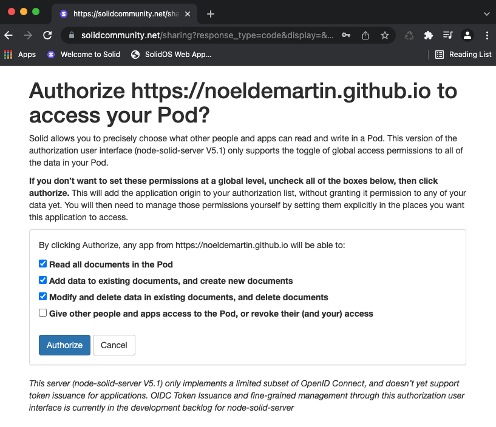

# acl:trustedApp

### Preamble

This document is currently a placeholder for future work on the `acl:trustedApp` predicate.  There is some debate in a [previous discussion](https://github.com/solid/webid-profile/pull/1) on whether we should address this predicate in this spec.

> @acoburn acoburn 12 days ago
This predicate is not part of the ACL vocabulary and is not described in the WAC specification. I would recommend omitting it.

> @jeff-zucker jeff-zucker 12 days ago
However acl:trustedApp is in use and is kind of central to the current app ecosystem. Hopefully we can think of a way to document it while pointing to alternatives.

## Introduction

In our research we noticed that there are different ways how to go about authorization. We found the following options:
* NSS uses trusted apps and an authorization page (not part of WAC yet)
* WAC
* ACP 
* Data interoperability panel which uses the Authorization Agent

## NSS

* Tim BL: TrustedApps comes from the way the browser works. Browser assumes there is no trust between different domains.

### Authorization process

* The process of authorization is implemented on NSS and it is as follows:

1. WebId user navigated to a Solid App and for example registers with Solid WebID.
2. Upon registration user is redirected to login and afterwards to an authorization page where several checkboxes can be used to choose read, write, edit or control options for the App the user is logging in. See next screenshot:



### Authorization management

* In SolidOS frontend one has the opportunity under the menu item `Preferences` to manage the Trusted Apps: add, delete, change authorization level.
* See screen shots and details in the [SolidOS User Guide](https://github.com/solid/userguide#manage-your-trusted-applications)

### Data model created

* An example of the used data model we can find in SolidOS which inserts in the profile the following triples upon the authorization of an app. The next examples contains two trusted apps which originate on <https://timbl.com> and <https://noeldemartin.github.io>.

```
:me acl:trustedApp
  [
        acl:mode acl:Append, acl:Read, acl:Write;
        acl:origin <https://timbl.com>
  ],
  [
        acl:mode acl:Append, acl:Read, acl:Write;
        acl:origin <https://noeldemartin.github.io>
  ];
```

* The acl:trustedApp is not part of the WAC specification as of now. However, there is a request to add it: <https://github.com/solid/vocab/issues/64>.

## WAC

* [Web Access Control (WAC)](https://solidproject.org/TR/wac).

## APC

* [Access Control Policies (ACPs)](https://solid.github.io/authorization-panel/acp-specification/).

## Data Interoperability Panel

* In the [data interoperability panel](https://github.com/solid/data-interoperability-panel) authorization is handeled by the [Authorization Agent](https://solid.github.io/data-interoperability-panel/specification/#authorization-agent-discovery).
